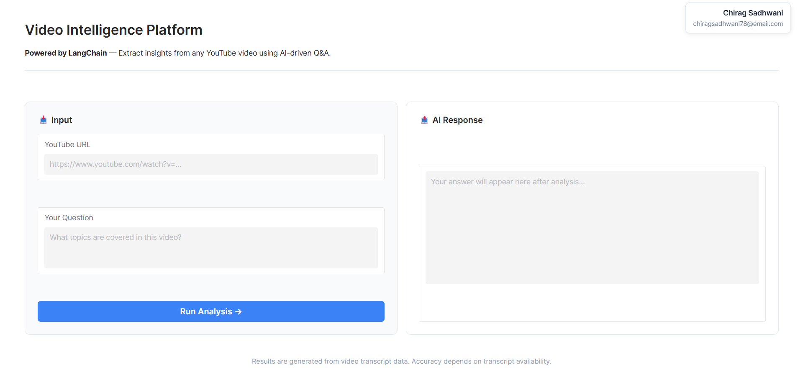
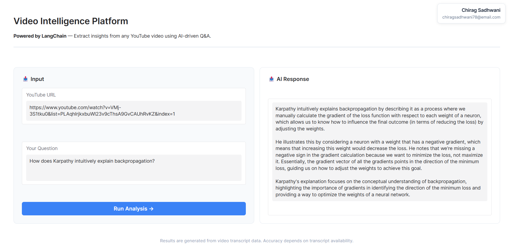

# YouTube Chatbot – QA & Summarization using RAG

An **AI-powered YouTube Video Intelligence Platform** that enables users to ask natural language questions about any YouTube video and receive **accurate, context-aware answers** using **Retrieval-Augmented Generation (RAG)**.

This project demonstrates a **production-style GenAI pipeline** using **LangChain**, **FAISS**, **Hugging Face LLaMA 3.1**, and **Gradio**, with a clean modular architecture.

---

## Problem Statement

YouTube videos contain valuable information, but extracting insights from long videos is time-consuming.  
This project solves that problem by allowing users to:

- Ask questions directly about video content  
- Retrieve precise answers grounded in the video transcript  
- Interact via a simple web-based UI  

---

## Key Features

- Accepts any public YouTube video URL  
- Automatically extracts video transcripts  
- Splits transcript into semantic chunks  
- Stores embeddings in a FAISS vector database  
- Retrieves relevant context using similarity search  
- Generates grounded answers using LLaMA 3.1  
- Interactive Gradio web interface  
- Modular, scalable codebase  

---

## System Architecture (RAG Pipeline)
## Tech Stack

- **Python**
- **LangChain**
- **FAISS**
- **Hugging Face Hub**
- **LLaMA 3.1 – 8B Instruct**
- **Sentence Transformers (MiniLM)**
- **Gradio**
- **YouTube Transcript API**
- **dotenv**

---

## Project Structure

---

## Code Overview

### 1️`app_interface.py`
- Builds the **Gradio UI**
- Accepts YouTube URL and user query
- Connects UI to the RAG backend
- Displays AI-generated answers

---

### 2️`ingestion_service.py`
- Extracts video ID from YouTube URL
- Fetches transcript using YouTube Transcript API
- Cleans and formats transcript text

---

### 3️`langchain_orchestrator.py`
- Splits transcript into chunks
- Generates embeddings using Sentence Transformers
- Stores vectors in FAISS
- Retrieves relevant chunks
- Constructs prompt and invokes LLaMA 3.1 via LangChain

---

## Application Preview

### Homepage

  

### AI Response

  

